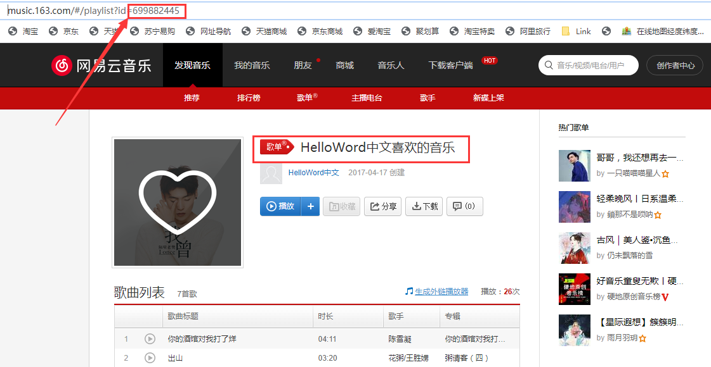

# halo-ctlyt-gently
halo主题ctlyt-gently

主题预览地址：http://ctlyt.yunypan.cn/

## 主题介绍

> 导航栏支持跟随滚动和固定两种方式
>
> 主页支持设置无图模式
>
> 导航栏支持设置二级菜单
>
> 文章分享可以根据需求设置分享平台
>
> halo1.3支持所有标签和所有分类图片显示

### 主题设置：

#### 个性化

- [x] 顶部搜索框
  - [x] 开启
  - [ ] 关闭

- [x] 粘性导航栏
  - [x] 开启
  - [ ] 关闭

- [x] 侧边栏个人资料
  - [x] 开启
  - [ ] 关闭

- [x] 侧边栏分类
  - [x] 开启
  - [ ] 关闭

- [x] 侧边栏标签
  - [x] 开启
  - [ ] 关闭

- [x] 菜单样式
  - [x] 级联菜单
  - [ ] 列表
- [x] 侧边栏最近文章
  - [x] 开启
  - [ ] 关闭
- [x] 主页侧边栏
  - [x] 开启
  - [ ] 关闭
- [x] 主页无图模式
  - [ ] 开启
  - [x] 关闭
- [ ] 主页banner图
- [ ] 其他页banner图
- [ ] 其他页背景图

#### 文章设置

- [x] 文章分享
  - [ ] 开启
  - [ ] 关闭

- [x] 分享组件 'qzone','qq','weibo','wechat','douban：
  - [ ] 'qzone','qq','weibo','wechat','douban'

- [ ] 支付宝捐赠二维码
- [ ] 微信捐赠二维码
- [x] 文章代码高亮主题
  - [x] Default		默认
  - [ ] Tomorrow
  - [ ] Zenburn
  - [ ] Atom-one-light
  - [ ] Mono-blue
  - [ ] Vs
  - [ ] Github

#### 社交设置

- [ ] Github  'Github 用户名'
- [ ] QQ  'QQ 号'
- [ ] 微博  '微博用户名'
- [ ] Twitter  'Twitter 用户名'
- [ ] Facebook  'Facebook 用户名'
- [ ] Email  '邮箱地址'
- [ ] Telegram  'Telegram 用户名'

#### 自定义连接

- [ ] 底部链接

## 更新日志

> 2020-03-21	页面样式bug修改
>
> 2020-03-21	加入无图模式加快首页访问速度
>
> 2020-03-22	加入所有标签和所有分类图片显示
> 
> 2020-04-01  修改默认博客的部分bug
>
> 2020-04-01  加入暗黑模式
>
> 2020-04-01  支持``Halo 1.3.1``(其实我想骂人)
>
> 2020-04-01  添加小插件``小女孩``
>
> 2020-04-01  添加小插件``音乐播放``

## 后期优化

## 安装方法

### 方法一

1. [点击](https://github.com/cuntoulaoyangtou/halo-them-ctlyt-gently/archive/master.zip)下载。
2. 进入后台 -> 外观 -> 主题。
3. 点击右下方按钮选择安装主题，随后选择 `本地上传`。
4. 选择下载好的主题包（zip）即可。

### 方法二

1. 复制 https://github.com/cuntoulaoyangtou/halo-them-ctlyt-gently.git。
2. 进入后台 -> 外观 -> 主题。
3. 点击右下方按钮选择安装主题，随后选择 `远程拉取`。
4. 粘贴复制的链接到远程地址，点击下载即可。

## 更新方法

### 方法一

1. 进入后台 -> 外观 -> 主题。
2. 找到需要更新的主题，点击主题下方的 `更多` 按钮。
3. 点击 `在线更新`。

### 方法二

1. [点击](https://github.com/cuntoulaoyangtou/halo-them-ctlyt-gently/archive/master.zip)下载最新的版本。
2. 进入后台 -> 外观 -> 主题。
3. 找到需要更新的主题，点击主题下方的 `更多` 按钮。
4. 点击 `从主题包更新`，选择下载好的主题包（zip）即可。

## 常见问题

#### 二级菜单的添加

1. 进入后台 -> 外观 -> 菜单
2. 添加菜单-> 上级菜单选择0是一级菜单
3. 添加菜单-> 上级菜单选择一级菜单者位二级菜单

#### 插入网易云音乐

打开网易云音乐创建歌单复制链接后的id``699882445``

